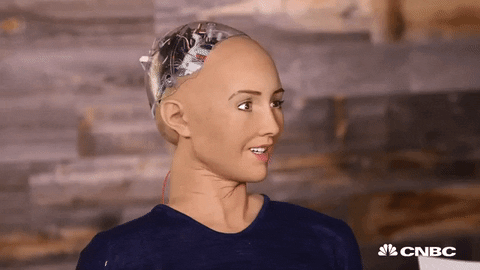
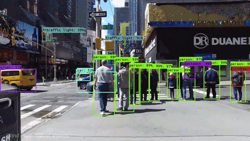

### Hello there 👨🏻‍💻

<!--
**FlavioLorenzi/flaviolorenzi** is a ✨ aspecial_ ✨ repository because its `README.md` (this file) appears on your GitHub profile.
-->

- 🔭 I’m currently working on my master thesis "Continuous Learning approach for the Activity Recognition task, using hybrid real - sinthetic(Unity making) dataset", engaged full time in a company internship at Konica Minolta R&D, Rome (Italy).

- 📫 How to reach me: Linkedin or Mail

  
  
  

"Engineers like to solve problems. 
If there are no problems handily available, they will create their own problems" 😉

